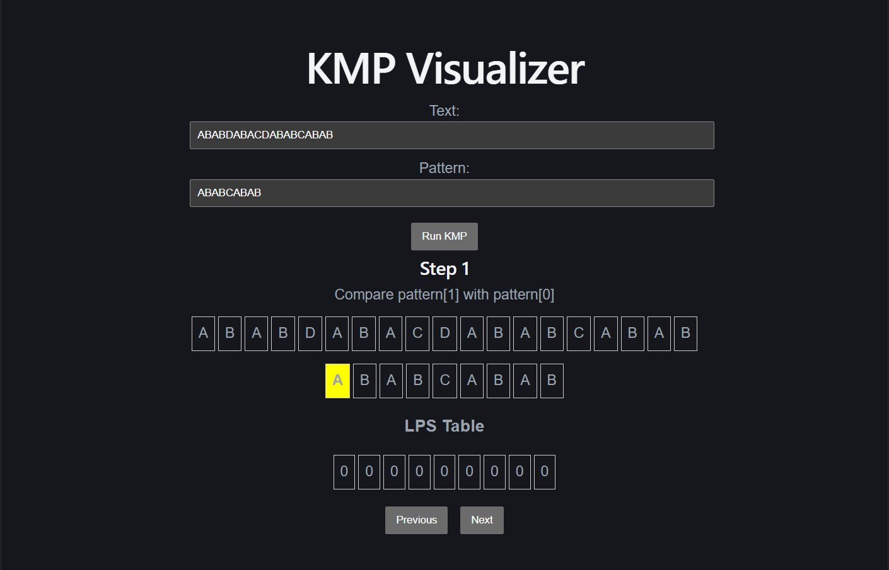
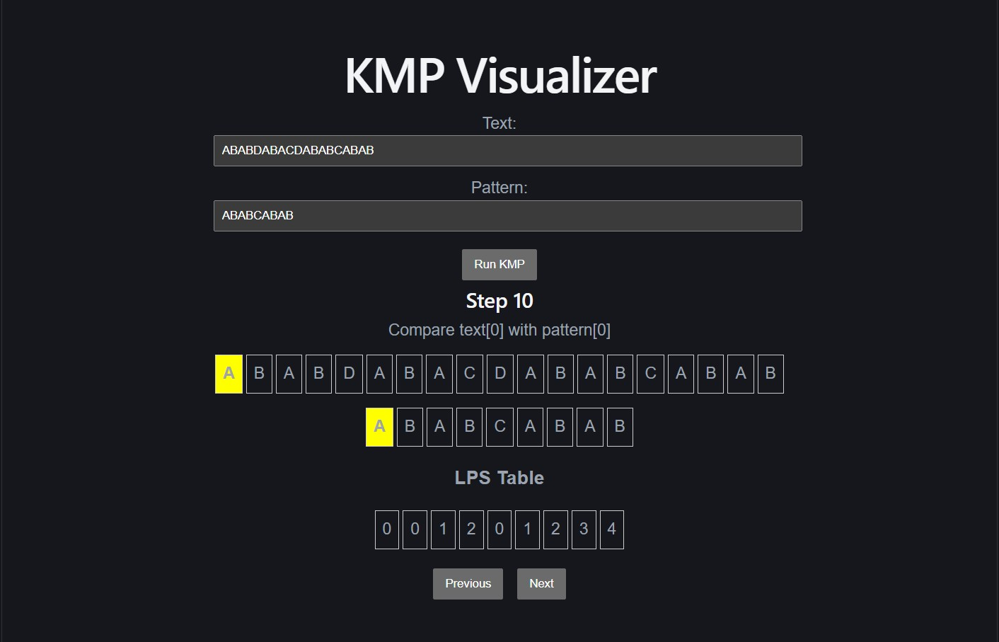
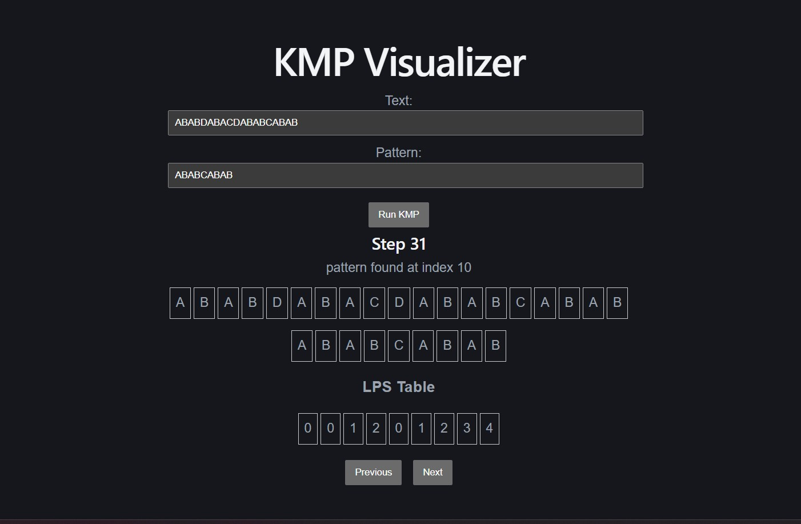

# Interactive-Algorithm-Visualizer-Platform
A Python project of a web app where users can run algorithms step-by-step and visually see the process, currently under development.

Completed features:
- KMP visualizer
- backend server using Python, FastAPI and Uvicorn
- GitHub Actions CI/CD pipeline - automated pytest script
- React + Vite frontend for KMP visualizer
- GitHub Actions CI/CD pipeline - automated frontend testing script

Ongoing development: 
